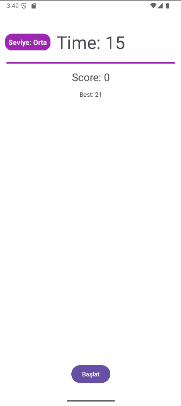
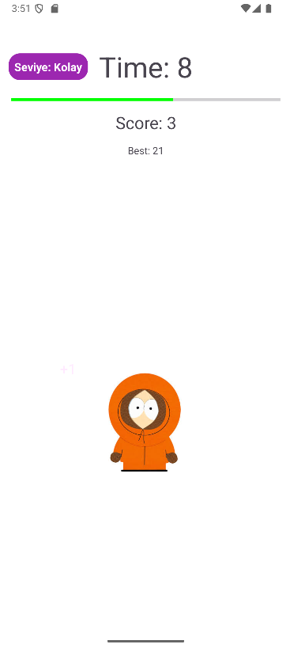
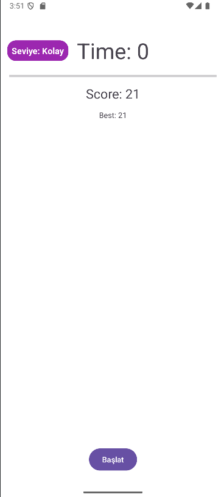
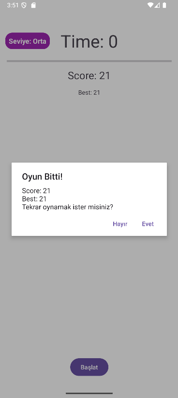
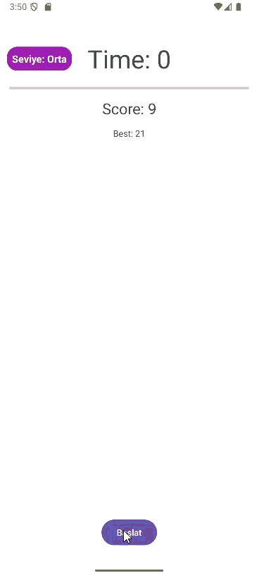

## 🎮 Kenny Catch Game (Android - Kotlin)

Kenny Catch Game, Android üzerinde geliştirilmiş basit ve eğlenceli bir refleks oyunudur.
Oyuncu, ekranda rastgele görünen Kenny karakterine tıklayarak puan toplar ve süre bitmeden mümkün olduğunca yüksek skor yapmaya çalışır.

## 🚀 Özellikler

-**Başlat Butonu:** Oyunu başlatır.

-**Zaman Göstergesi:** Ekranın üst kısmında kalan süreyi gösterir.

-**Skor ve Best Score:** Oyuncunun mevcut skoru ve en yüksek skoru takip edilir.

-**Zorluk Seviyeleri:** Kolay, Orta ve Zor seçenekleri tıklanabilir şekilde üst köşede gösterilir. Seviyeye göre Kenny’in görünme süresi değişir.

-**ProgressBar:** Kalan süreyi görsel olarak takip etmeyi sağlar ve renk değiştirir (Yeşil → Sarı → Kırmızı).

Görsel Efektler:

-Kenny’ye tıklayınca +1 animasyonu ekrana çıkar.

-Sparkle efekti yıldızlar şeklinde Kenny etrafında patlar.

-Oyun bittiğinde confetti efekti gösterilir.

## 🛠 Kullanılan Teknolojiler

**Kotlin** – Android programlama dili

**XML Layout** – UI tasarımı

**ConstraintLayout & LinearLayout** 

**ImageView & ProgressBar** – Oyun nesneleri ve zaman takibi

**CountDownTimer** – Oyun süresini yönetmek için

**Animasyonlar**  – Etkileşim ve görsel deneyimi artırmak için

## 📸 Ekran Görüntüleri

 

## ▶️ Çalıştırma

-Android Studio ile projeyi aç.

-Emülatör veya gerçek cihazda çalıştır.

-Başlat butonuna bas ve Kenny’i yakala! 🎉

-Üst köşedeki Seviye yazısına tıklayarak zorluk seviyesini değiştirebilirsin.

## - **Demo GIF**

  

